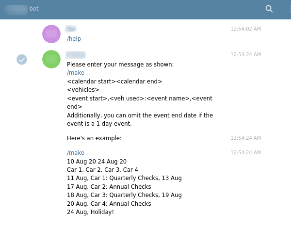
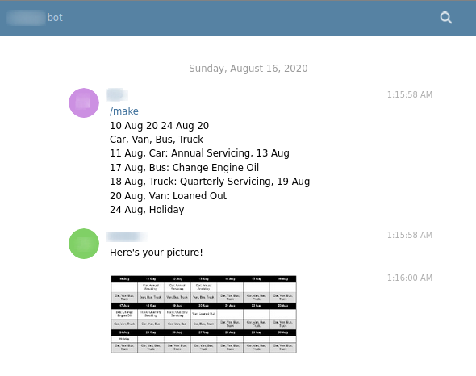
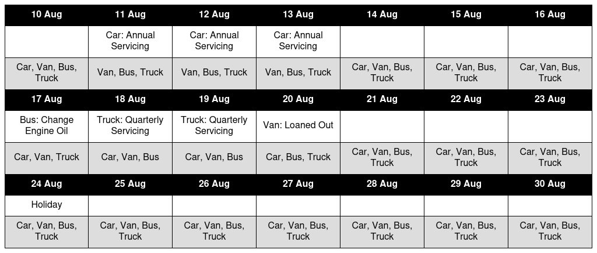

# Schedule Bot
## What the bot does
* Recieve text input of upcoming events and vehicles/equipment to track
* Generates an image of the schedule of events with 3 rows
    - Row 1: Date
    - Row 2: Events on that date
    - Row 3: Available vehicles/equipment on that day
* Note that the bot assumes the start of the week as Monday

## Screenshots
#### Using the "/help" command shows you a template as well as an example text

#### An example of the bot in action

#### An example of the generated image

## How it works
1. Bot recieves the data
2. Servers parses the data and checks for errors
3. Events are added to a HTML table
4. imgkit converts the html table to an image
5. Image is sent to the user

## Python modules used
* [imgkit](https://github.com/jarrekk/imgkit)
* [python-telegram-bot](https://github.com/python-telegram-bot/python-telegram-bot)
